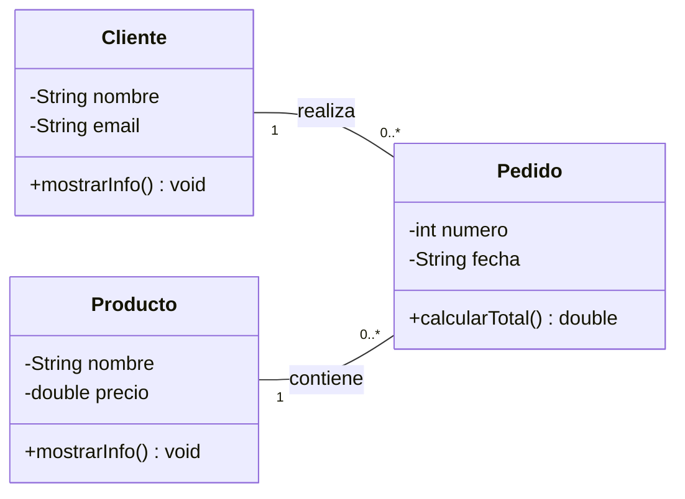

## Ejercicio 1: Tienda online simple

* Un **Producto** tiene nombre y precio.
* Un **Cliente** tiene nombre y correo electrónico.
* Un **Pedido** representa la compra de un producto por un cliente.

## Diagrama de clases (Mermaid)

Implementa en **Java** las clases representadas en el diagrama:

1. Crear las clases `Producto`, `Cliente` y `Pedido`.
2. Añadir:

   * atributos privados
   * constructores
   * getters y setters para los atributos privados
3. La clase `Pedido` debe tener:

   * un `Cliente`
   * un `Producto`
4. Implementar el método `calcularTotal()` que devuelva el precio del producto.

5. El proyecto debe implementar todo lo solicitado y compilar con `mvn compile`.

6. En la carpeta **docs** debes adjuntar capturas de pantalla de tus clases y el resultado de la compilación.

7. Añade las explicaciones que consideres en `docs/explicacion.md`.