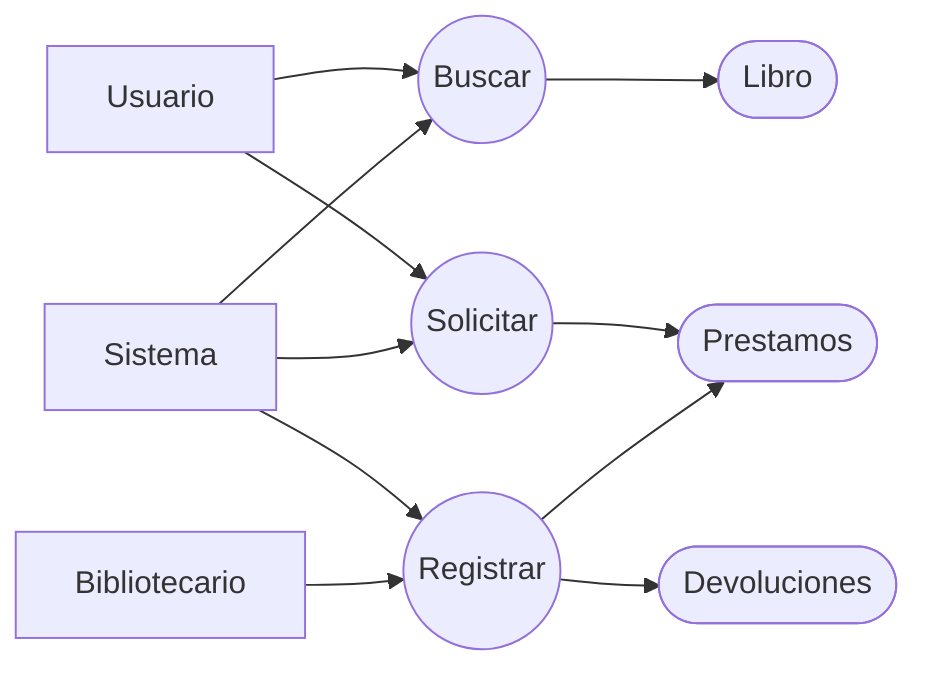

```mermaid
graph LR

usuario[Usuario]
buscar((Buscar))
solicitar((Solicitar))
prestamos([Prestamos])
libro([Libro])

usuario --> buscar --> libro
usuario --> solicitar --> prestamos

sistema[Sistema]

sistema --> buscar
sistema --> solicitar
sistema --> registrar

bibliotecario[Bibliotecario]
registrar((Registrar))
devoluciones([Devoluciones])

bibliotecario --> registrar --> prestamos
registrar --> devoluciones


```